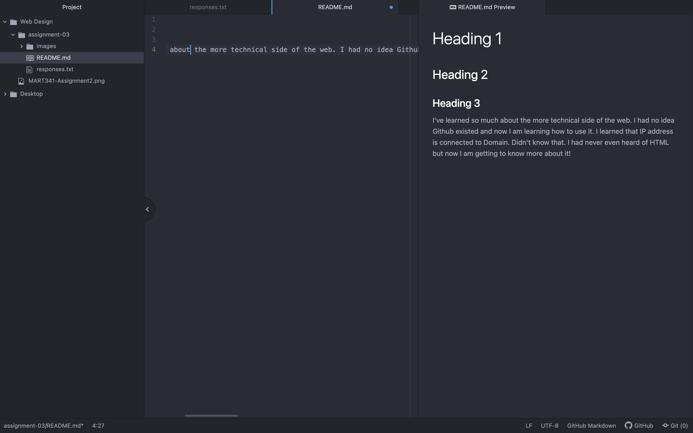

# Heading 1
## Heading 2
### Heading 3
I've learned so much about the more technical side of the web. I had no idea Github existed and now I am learning how to use it. I learned that IP address is connected to Domain. Didn't know that. I had never even heard of HTML but now I am getting to know more about it!

[My Responses](./responses.txt)

