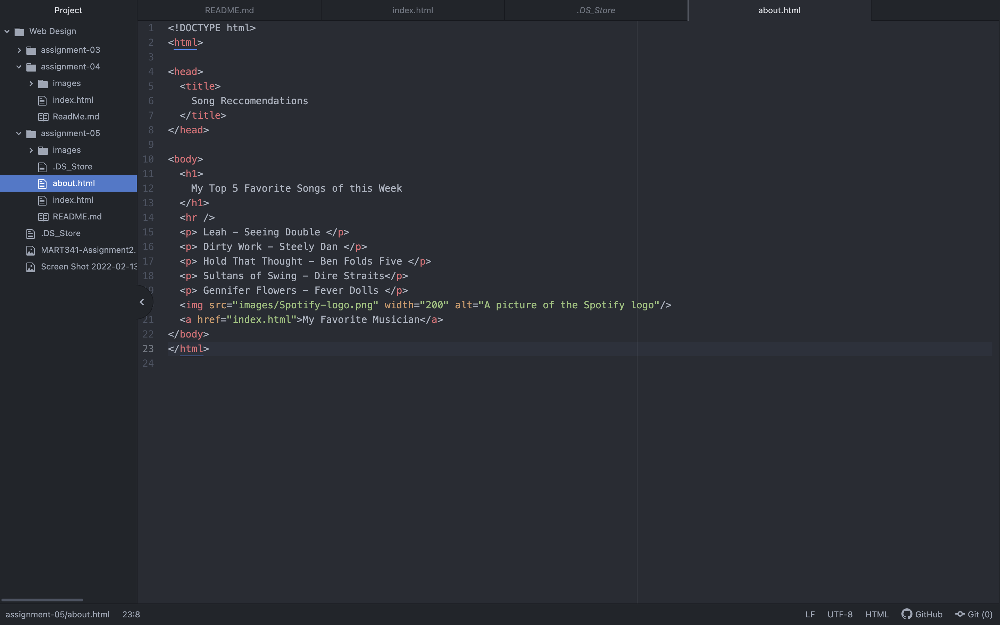
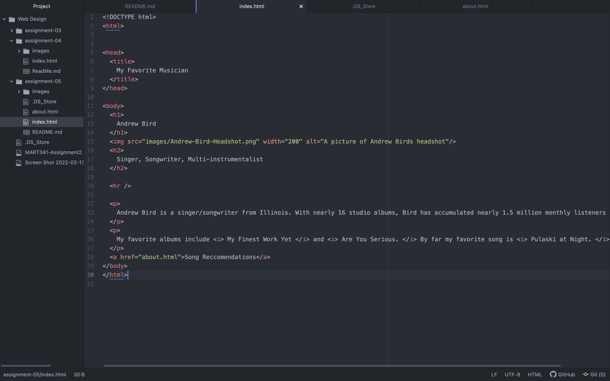
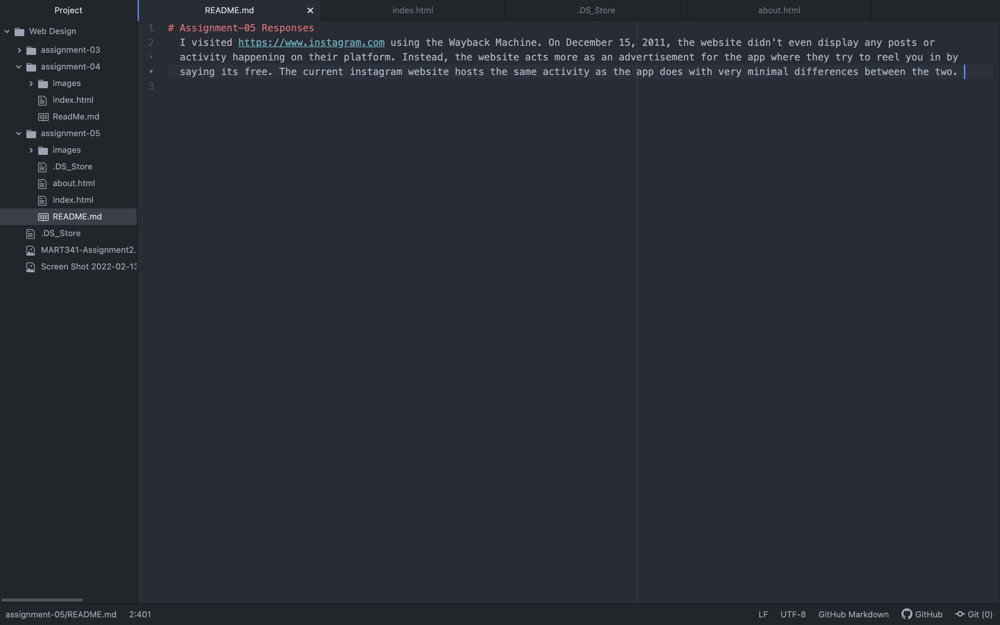

# Assignment-05 Responses
  I visited https://www.instagram.com using the Wayback Machine. On December 15, 2011, the website didn't even display any posts or activity happening on their platform. Instead, the website acts more as an advertisement for the app where they try to reel you in by saying its free. The current instagram website hosts the same activity as the app does with very minimal differences between the two.

  
  
  
