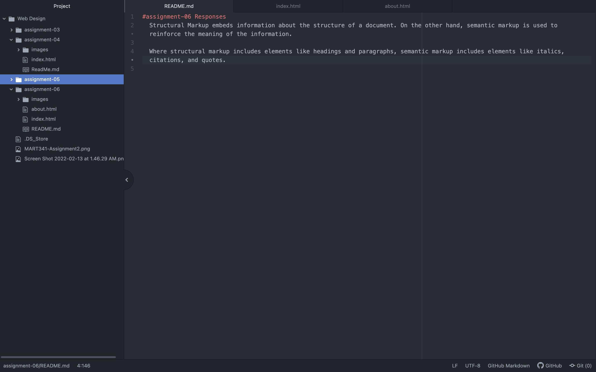

# assignment-06 Responses
  Structural Markup embeds information about the structure of a document. On the other hand, semantic markup is used to reinforce the meaning of the information.

  Where structural markup includes elements like headings and paragraphs, semantic markup includes elements like italics, citations, and quotes.

  
