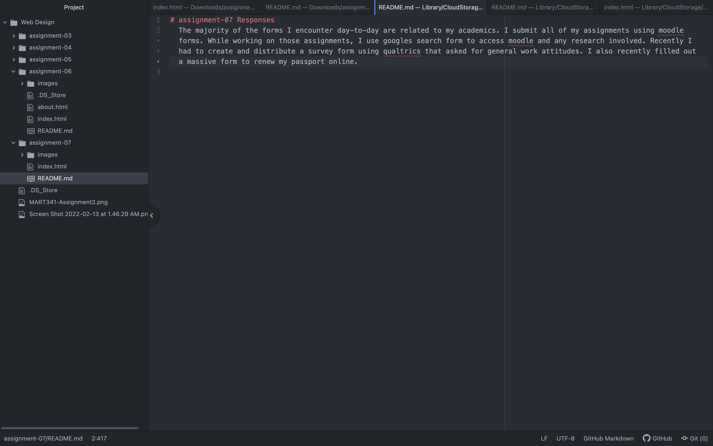

# assignment-07 Responses
  The majority of the forms I encounter day-to-day are related to my academics. I submit all of my assignments using moodle forms. While working on those assignments, I use googles search form to access moodle and any research involved. Recently I had to create and distribute a survey form using qualtrics that asked for general work attitudes. I also recently filled out a massive form to renew my passport online.

