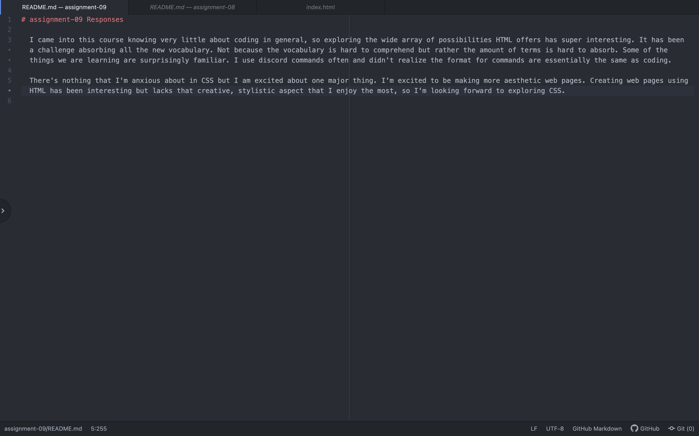

# assignment-09 Responses

  I came into this course knowing very little about coding in general, so exploring the wide array of possibilities HTML offers has super interesting. It has been a challenge absorbing all the new vocabulary. Not because the vocabulary is hard to comprehend but rather the amount of terms is hard to absorb. Some of the things we are learning are surprisingly familiar. I use discord commands often and didn't realize the format for commands are essentially the same as coding.

  There's nothing that I'm anxious about in CSS but I am excited about one major thing. I'm excited to be making more aesthetic web pages. Creating web pages using HTML has been interesting but lacks that creative, stylistic aspect that I enjoy the most, so I'm looking forward to exploring CSS.

  
