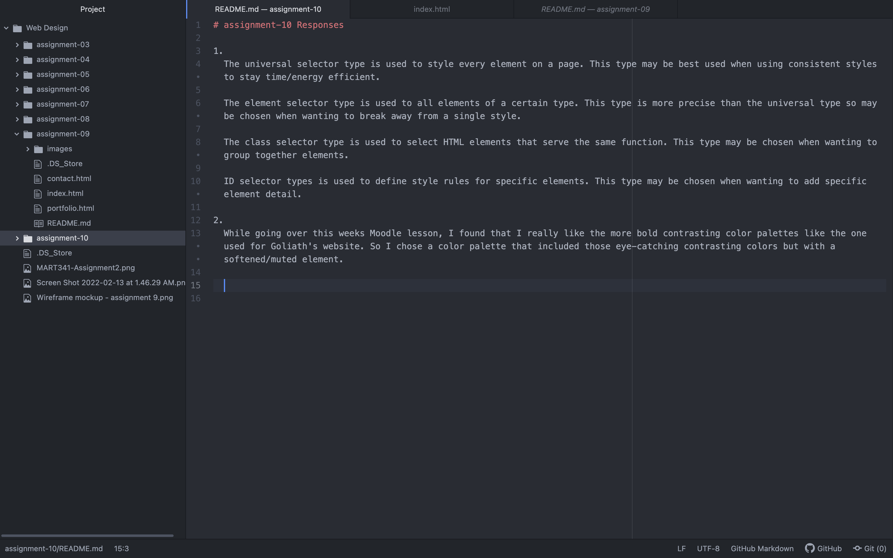

# assignment-10 Responses

1.
  The universal selector type is used to style every element on a page. This type may be best used when using consistent styles to stay time/energy efficient.

  The element selector type is used to all elements of a certain type. This type is more precise than the universal type so may be chosen when wanting to break away from a single style.

  The class selector type is used to select HTML elements that serve the same function. This type may be chosen when wanting to group together elements.

  ID selector types is used to define style rules for specific elements. This type may be chosen when wanting to add specific element detail.

2.
  While going over this weeks Moodle lesson, I found that I really like the more bold contrasting color palettes like the one used for Goliath's website. So I chose a color palette that included those eye-catching contrasting colors but with a softened/muted element.

  
