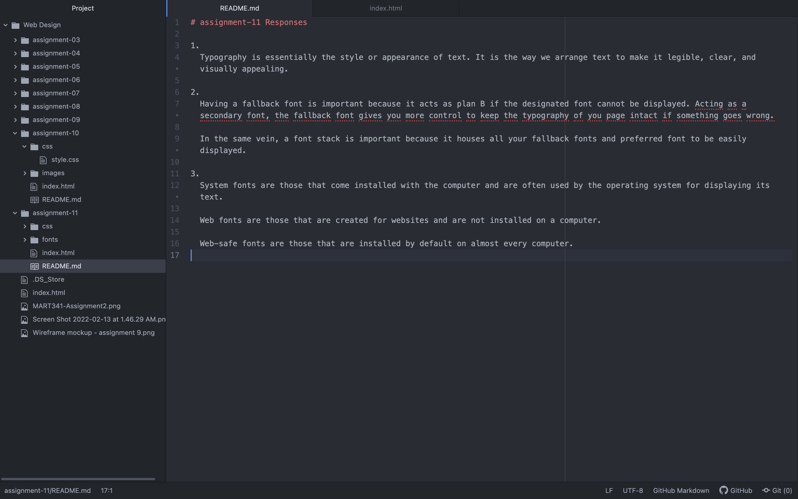

# assignment-11 Responses

1.
  Typography is essentially the style or appearance of text. It is the way we arrange text to make it legible, clear, and visually appealing.

2.
  Having a fallback font is important because it acts as plan B if the designated font cannot be displayed. Acting as a secondary font, the fallback font gives you more control to keep the typography of you page intact if something goes wrong.

  In the same vein, a font stack is important because it houses all your fallback fonts and preferred font to be easily displayed.

3.
  System fonts are those that come installed with the computer and are often used by the operating system for displaying its text.

  Web fonts are those that are created for websites and are not installed on a computer.

  Web-safe fonts are those that are installed by default on almost every computer.

