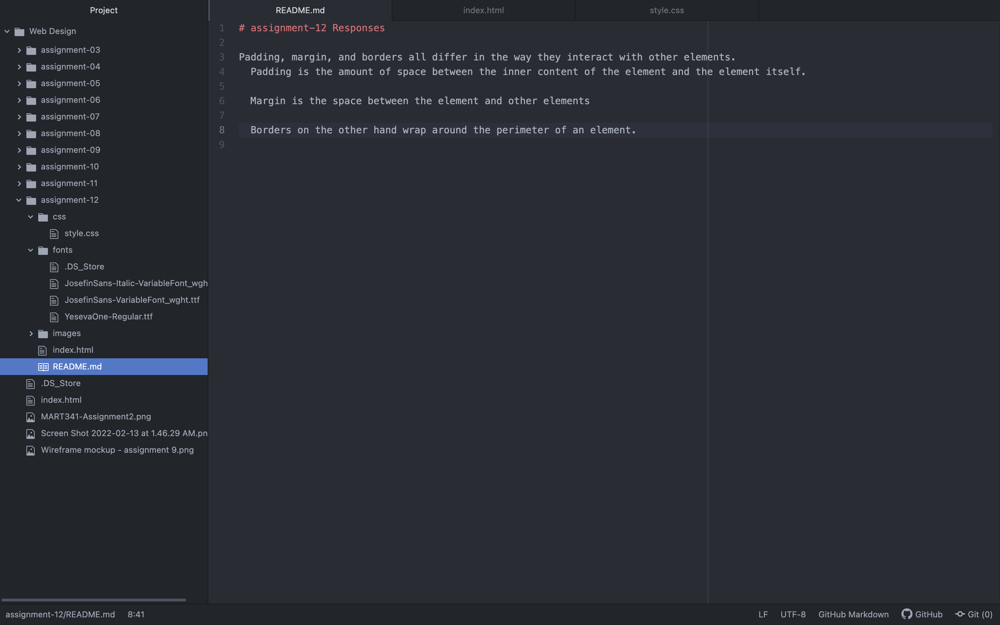

# assignment-12 Responses

Padding, margin, and borders all differ in the way they interact with other elements.
  Padding is the amount of space between the inner content of the element and the element itself.

  Margin is the space between the element and other elements

  Borders on the other hand wrap around the perimeter of an element.

