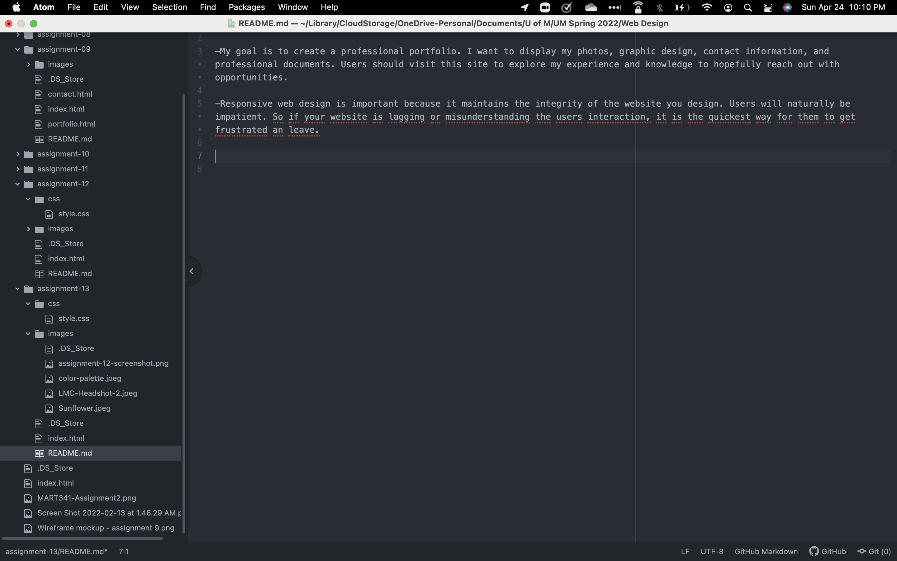

# assignment-13 Responses

-My goal is to create a professional portfolio. I want to display my photos, graphic design, contact information, and professional documents. Users should visit this site to explore my experience and knowledge to hopefully reach out with opportunities.

-Responsive web design is important because it maintains the integrity of the website you design. Users will naturally be impatient. So if your website is lagging or misunderstanding the users interaction, it is the quickest way for them to get frustrated an leave.

